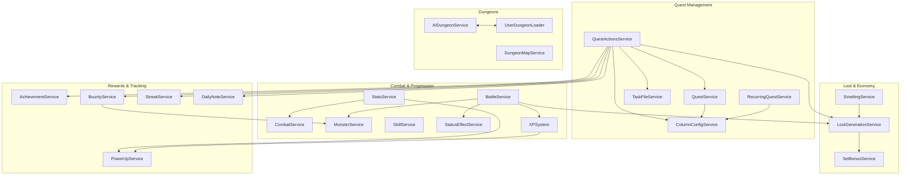

# System Dependency Matrix

> **Last Updated:** 2026-02-07 | **Purpose:** Bird's-eye view of which systems depend on which others

---

## How to Read This

- **Rows** = the system that *depends on* something
- **Columns** = the system being *depended upon*
- ● = direct import dependency

---

## Service → Service Dependencies

Shows which services import from other services. Heavy columns = high-impact change targets.

| Depends On → ↓ Uses | ColumnConfig | QuestService | TaskFile | MonsterService | LootGen | XPSystem | PowerUp | CombatService | SkillService | StatusEffect | SetBonus | StreakService | AchievementService | BountyService | DailyNote | StatusBar | RecoveryTimer | FolderWatch | UserDungeonLoader | AIDungeon |
|---|---|---|---|---|---|---|---|---|---|---|---|---|---|---|---|---|---|---|---|---|
| **QuestService** | ● | | | | | | | | | | | | | | | | | | | |
| **QuestActionsService** | ● | ● | ● | | ● | | | | | | | ● | ● | ● | ● | | | | | |
| **BattleService** | | | | ● | ● | ● | | | | ● | | | | | | | | | | |
| **StatsService** | | | | | | | ● | ● | | | | | | | | | | | | |
| **XPSystem** | | | | | | | ● | | | | | | | | | | | | | |
| **SmeltingService** | | | | | ● | | | | | | | | | | | | | | | |
| **LootGeneration** | | | | | | | | | | | ● | | | | | | | | | |
| **BountyService** | | | | ● | | | | | | | | | | | | | | | | |
| **RecurringQuestService** | ● | | | | | | | | | | | | | | | | | | | |
| **BuffStatusProvider** | | | | | | | | | | | | | | | | ● | | | | |
| **RecoveryTimerStatus** | | | | | | | | | | | | | | | | ● | ● | | | |
| **TemplateService** | | | | | | | | | | | | | | | | | | ● | | |
| **UserDungeonLoader** | | | | | | | | | | | | | | | | | | | | ● |
| **AIDungeonService** | | | | | | | | | | | | | | | | | | | ● | |
| **TestCharGenerator** | | | | | ● | ● | | | | | | | | | | | | | | |

### Key Takeaways

| Highest Fan-In (most depended upon) | Count |
|---|---|
| **ColumnConfigService** | 3 services |
| **MonsterService** | 2 services |
| **LootGenerationService** | 3 services |
| **PowerUpService** | 2 services |
| **XPSystem** | 2 services |
| **StatusBarService** | 2 providers |

| Highest Fan-Out (most dependencies) | Count |
|---|---|
| **QuestActionsService** | 9 services |
| **BattleService** | 4 services |
| **StatsService** | 2 services |

> [!IMPORTANT]
> **QuestActionsService** is the primary orchestrator — it touches quest management, loot, streaks, achievements, bounties, and daily notes. Changes here have the widest blast radius.

---

## Hook → Service Dependencies

| Hook | Services Used |
|---|---|
| **useXPAward** | TaskFileService, XPSystem, StatsService, AchievementService, SkillService, StatusBarService |
| **useQuestLoader** | QuestService, TaskFileService |
| **useQuestActions** | QuestActionsService |
| **useFilteredQuests** | TaskFileService (types only) |
| **useCharacterSprite** | SpriteService |
| **useResourceRegen** | *(store-only)* |
| **useSaveCharacter** | *(store-only)* |
| **useDndQuests** | *(store-only)* |
| **useCollapsedItems** | *(store-only)* |

---

## Component → Service/Hook Dependencies

| Component | Services | Hooks |
|---|---|---|
| **FullKanban** | ColumnConfigService, XPSystem, QuestService | useQuestLoader, useQuestActions, useSaveCharacter, useDndQuests, useCollapsedItems, useXPAward, useResourceRegen, useFilteredQuests |
| **SidebarQuests** | ColumnConfigService, XPSystem, QuestService, AchievementService | useXPAward, useResourceRegen, useQuestLoader, useQuestActions, useSaveCharacter, useDndQuests, useCollapsedItems, useFilteredQuests, useCharacterSprite |
| **DungeonView** | LootGenerationService, MonsterService, BattleService, SpriteService | — |
| **BattleView** | BattleService | — |
| **CharacterPage** | AchievementService, XPSystem, PowerUpService, CombatService | useCharacterSprite, useSaveCharacter |
| **CharacterSidebar** | XPSystem, PowerUpService, CombatService | — |
| **AchievementsSidebar** | AchievementService | — |
| **QuestCard** | TaskFileService (types only) | — |
| **Minimap** | DungeonMapService | — |

---

## Store Usage by Services

| Store | Services That Access It |
|---|---|
| **characterStore** | QuestActionsService, BattleService, SmeltingService, RecoveryTimerService, RecoveryTimerStatusProvider, BuffStatusProvider |
| **battleStore** | BattleService, SkillService (types), BalanceTestingService (types) |
| **questStore** | QuestActionsService |
| **taskSectionsStore** | QuestActionsService |

---

## System Dependency Diagram

---

## Phase 5 Impact Analysis

For planned Phase 5 features, here's what each will touch:

| Feature | Primary Systems | Risk Level |
|---|---|---|
| **Party System** | BattleService, CharacterStore, BattleStore, BattleView, CombatService | 🔴 High — BattleService has 4 service deps + 2 store deps |
| **Dual-Class** | SkillService, XPSystem, StatsService, CharacterStore | 🟡 Medium — isolated to progression systems |
| **Class Change** | CharacterStore, SkillService, StatsService | 🟢 Low — mostly data changes |
| **Quest Dependencies** | QuestService, QuestActionsService, QuestStore | 🟡 Medium — QAS is high fan-out |
